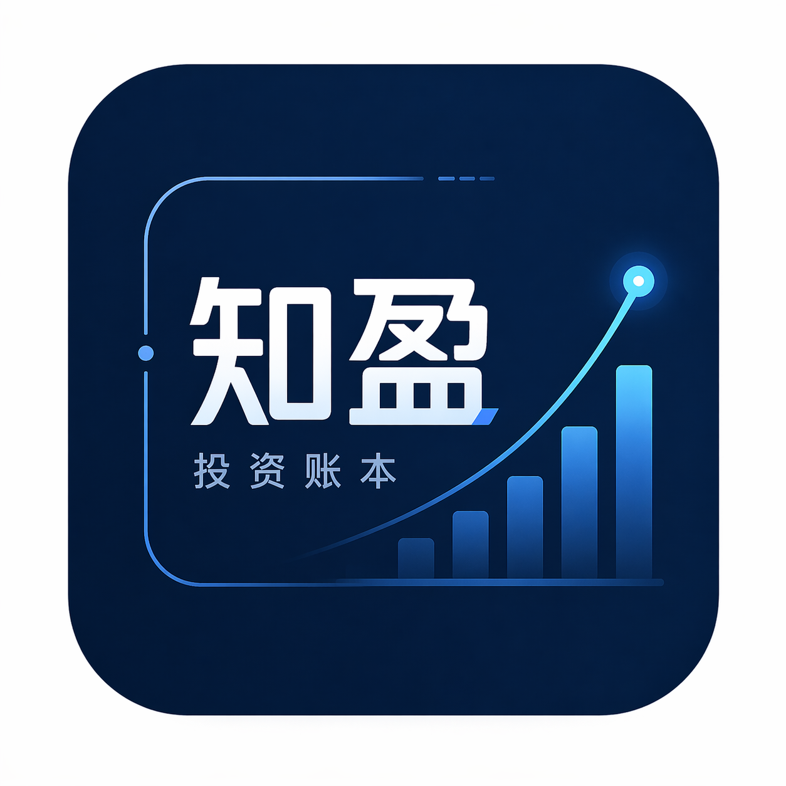

# 知盈 - 投资账本

<p align="center">
  
</p>

<p align="center">
  个人多市场、多币种投资组合追踪工具
</p>

---

## 功能概览

- **多市场支持** — A股、港股、美股、法国股票、瑞典股票、德国股票、中国金融期货 (中金所)
- **多账户** — 投资账本 + 券商账户，支持持仓关联和比例同步
- **多币种现金管理** — CNY / USD / HKD / EUR / SEK，入金/出金全记录
- **实时行情** — 5 分钟自动刷新，支持手动刷新，多级数据源回退，盘前/盘后价格
- **资产总览** — 总资产 (持仓 + 现金)、浮动盈亏、已实现盈亏明细、市场/币种分布，可切换展示币种
- **K线图** — 鼠标悬停 symbol 显示迷你 K 线 (支持日内/1月/3月切换)
- **美股IPO监测** — 已上市/待上市列表，上市提醒 (7天前弹窗通知)
- **实时资讯** — 金十数据市场快讯，新快讯全局提醒
- **交易记录** — 建仓/买入/卖出/入金/出金全历史，支持删除并还原持仓和现金
- **持有比例** — 支持部分持有 (如 33%)，市值/保证金/盈亏按比例计算
- **期货保证金模式** — 买入不扣现金，卖出按盈亏入现金，总览展示保证金占用
- **4 套主题** — 极光 (明亮蓝)、翡翠 (明亮绿)、星轨 (酷炫紫暗)、深海 (经典蓝暗)
- **底部指数行情条** — 上证指数、创业板50、科创50、标普500、纳斯达克、恒生指数、恒生科技
- **毛玻璃 + 动画** — 弹窗、侧边栏、下拉框全局 backdrop-blur 效果

## 技术栈

| 层 | 技术 |
|----|------|
| 前端 | React 19 + TypeScript + Tailwind CSS v4 + TanStack Query v5 + Vite |
| 后端 | Python 3 + FastAPI + SQLAlchemy 2.0 + SQLite |
| 行情数据 | Google Finance + yfinance + finance-query.com + AKShare，盘前/盘后价格支持 |
| IPO数据 | moomoo.com 爬取 (Playwright 无头浏览器)，后台每小时更新 |
| 汇率 | yfinance forex，USD 中间价机制 |

## 快速开始

### 环境要求

- Python 3.11+
- Node.js 18+

### 一键安装与启动 (推荐)

```bash
git clone <repo-url> zhiying-portfolio-book
cd zhiying-portfolio-book

./setup.sh   # 首次部署：创建 venv、安装依赖、下载 playwright 浏览器
./start.sh   # 启动前后端 (Ctrl+C 即可停止)
./stop.sh    # 停止前后端
```

数据库表会在首次启动时自动创建。日志输出在 `.logs/{backend,frontend}.log`。

### 手动启动

```bash
# 后端
cd backend
python3 -m venv .venv
source .venv/bin/activate    # Windows: .venv\Scripts\activate
pip install -r requirements.txt
playwright install chromium   # IPO 爬虫需要
uvicorn app.main:app --reload --port 8000

# 前端 (另开终端)
cd frontend
npm install
npm run dev
```

打开浏览器访问 http://localhost:5173

后端 API 文档: http://localhost:8000/docs

## 支持的市场

| 市场 | 代码格式 | 币种 | 数据源 |
|------|----------|------|--------|
| A股 | `600519`, `000858`, `300750` | CNY | AKShare / finance-query |
| 港股 | `0700.HK` | HKD | Google Finance / yfinance |
| 美股 | `AAPL`, `GOOGL` | USD | Google Finance / yfinance / finance-query |
| 法股 | `MC.PA` | EUR | Google Finance / yfinance |
| 瑞典股 | `VOLV-B.ST` | SEK | Google Finance / yfinance |
| 德股 | `SAP.DE` | EUR | Google Finance / yfinance |
| 中国期货 | `IC2609`, `IF2506` | CNY | AKShare |

## 核心功能说明

### 资产计算

```
股票市值 = 数量 × 现价 × 合约乘数 × 持有比例
期货市值 = 保证金占用 + 浮动盈亏
保证金占用 = 数量 × 成本价 × 乘数 × 保证金比例 × 持有比例
浮动盈亏 = (现价 - 成本价) × 数量 × 乘数 × 持有比例
总资产 = 持仓市值 (折合展示币种) + 现金余额 (折合展示币种)
```

### 期货现金逻辑

- **买入 (开仓)**: 不扣减现金，总览展示保证金占用
- **卖出 (平仓)**: 现金 += (卖出价 - 成本价) × 数量 × 乘数 × 比例 (已实现盈亏)

### 券商账户 & 持仓关联

- 券商账户和投资账本独立管理持仓
- 投资账本的持仓可关联到券商账户持仓 (设置占比)
- 关联后数量和成本自动从券商同步
- 券商操作自动同步到关联持仓

### 涨跌颜色

遵循中国市场惯例: **红色为涨，绿色为跌**

## 项目结构

```
zhiying-portfolio-book/
├── logo.png
├── setup.sh                        # 一键环境部署脚本
├── start.sh                        # 一键启动脚本
├── stop.sh                         # 一键停止脚本
├── data/                           # SQLite 数据库 (gitignored)
├── .logs/                          # 启动日志 (gitignored)
│
├── backend/
│   ├── requirements.txt
│   └── app/
│       ├── main.py                 # FastAPI 入口 + 数据库迁移
│       ├── models/                 # 数据模型 (holding, transaction, account, ipo...)
│       ├── schemas/                # Pydantic 模型
│       ├── api/                    # API 路由
│       │   ├── holdings.py         # 持仓 CRUD
│       │   ├── transactions.py     # 交易记录
│       │   ├── market_data.py      # 行情刷新 + 指数 + K线
│       │   ├── portfolio.py        # 总览聚合 + 汇率
│       │   ├── cash.py             # 现金操作
│       │   ├── accounts.py         # 账户管理
│       │   ├── news.py             # 金十快讯
│       │   └── ipo.py              # 美股IPO监测
│       └── services/               # 业务逻辑
│
└── frontend/
    └── src/
        ├── pages/                  # 总览 / 持仓 / 记录 / 资讯 / IPO
        ├── components/
        │   ├── layout/             # Sidebar, MarketTicker, ThemeSwitcher, SettingsDialog
        │   ├── dashboard/          # SummaryCard, HoldingsTable, CashPanel, RealizedPnlTable
        │   ├── holdings/           # HoldingForm, TradeDialog
        │   ├── transactions/       # TransactionList
        │   └── common/             # MiniChart, IPOAlert, NewsAlert, ConfirmDialog
        ├── hooks/                  # React Query hooks
        ├── api/                    # Axios API 层
        └── types/                  # TypeScript 类型
```

## License

Personal use.
